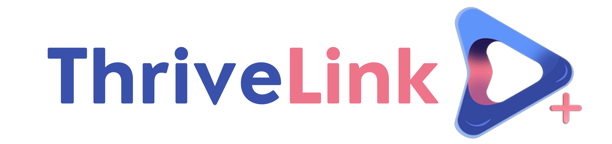
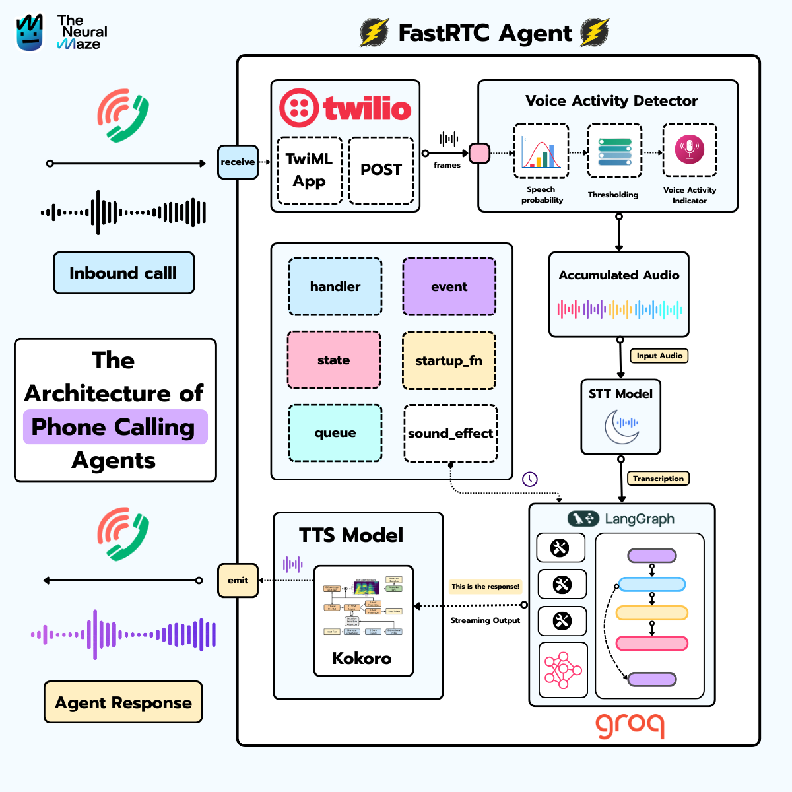
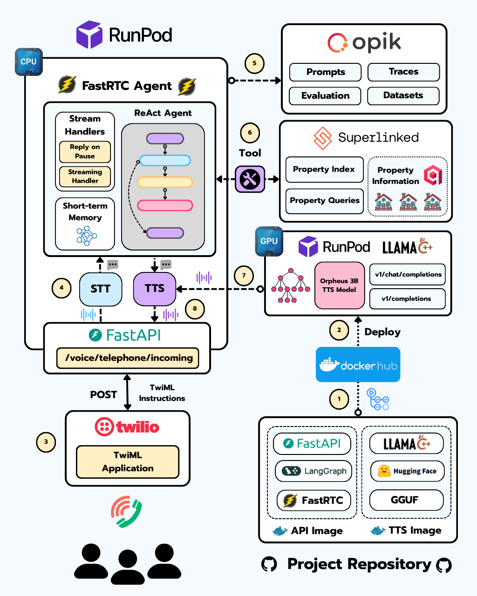
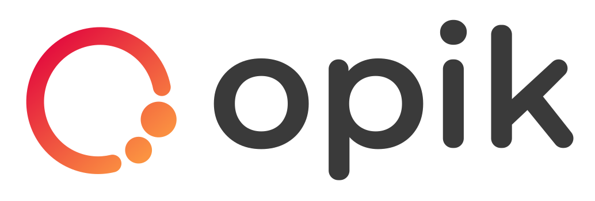
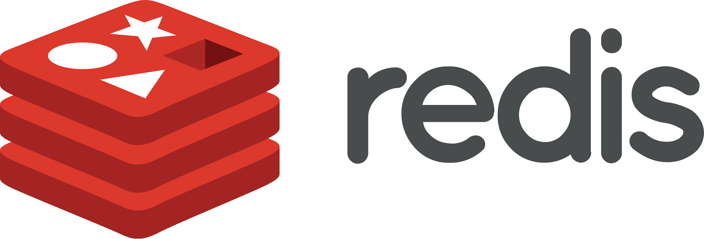

<div align="center">



# Roger — AI Voice Enrollment Agent

**A production-grade, real-time voice AI system that guides patients through government assistance program enrollment entirely over the phone — no app, no web form, no human agent required.**

Built by [ThriveLink](https://www.thrivelink.com) · Proprietary · All rights reserved

</div>

---

## Overview

A patient dials a Twilio phone number. Roger answers, identifies the caller's organization, presents available assistance programs, guides them through eligibility and identity verification, collects application answers one at a time through natural conversation, obtains consent, and submits the completed application — all within a single call.

Roger handles **7 languages**, **multiple concurrent tenants** on the same infrastructure, **sub-200ms barge-in**, and **full session recovery** if a call drops mid-enrollment. It serves elderly users, users with speech and cognitive disabilities, low-literacy populations, and limited-English speakers — all without any app, web form, or human agent.

This document describes the engineering architecture and design decisions behind the system. The implementation is proprietary and not publicly runnable.

---

## Impact

Millions of eligible Americans never enroll in SNAP, Medicaid, and WIC — not because they don't qualify, but because the process requires a smartphone, internet access, English literacy, or the stamina to navigate a complex web form. Roger eliminates every one of those barriers.

| Metric | Result |
|--------|--------|
| Completion rate vs. web-only | **+20–30%** |
| Data entry error reduction | **−70%** |
| ADA / Section 508 compliance | **95%** |
| Cost per enrollment (AI vs. human agent) | **$0.50 vs. $20–40** |

---

## System Architecture




---

## Enrollment Flow

Every call follows a deterministic state machine. The agent never free-forms through stages — each transition is an explicit LangGraph edge:

```
Greeting
  └─► Detect language (STT + LLM classifier)
        └─► Fetch dialer config (org + program catalog)
              └─► Present categories (voice + DTMF)
                    └─► Eligibility questions (paginated, public)
                          └─► Collect user info (name, phone, DOB)
                                └─► OTP verification
                                      └─► Application questions (dynamic, visibility-ruled)
                                            └─► Consent
                                                  └─► Submit → Finalize / Transfer
```

At any stage: pressing `#` or saying "main menu" resets to the program selection step. After 3 failed inputs on any field, the agent transfers the caller to a human care team.

---

## Agent Architecture

Roger uses a **class-based, compiled LangGraph hierarchy**. The pattern enforces a clean separation of concerns: a thin `BaseAgent` ABC defines the contract, each specialist owns its graph and state schema, and a supervisor delegates without knowing enrollment logic.

### 1 — BaseAgent: compile-once, invoke-many

Every agent inherits from `BaseAgent` (`core/base_agent.py`). The contract is minimal — subclasses implement `build_graph()` and `get_state_schema()`; everything else (compilation, checkpointing, tracing, dual-model setup) is inherited:

```python
# core/base_agent.py
class BaseAgent(ABC):
    def __init__(self, name: str, model=None, system_prompt=None, enable_memory=True):
        self.model      = model or self._get_default_model()   # GPT-4.1-mini
        self.light_model = self._get_light_model()             # GPT-4o-mini — latency-sensitive nodes
        self.checkpointer = MemorySaver() if enable_memory else None

    @abstractmethod
    def build_graph(self) -> StateGraph: ...

    def compile(self, **kwargs):
        if self.compiled_graph is None:
            self.graph = self.build_graph()
            self.compiled_graph = self.graph.compile(
                checkpointer=self.checkpointer, **kwargs
            )

    async def ainvoke(self, inputs, config=None, thread_id=None):
        if self.compiled_graph is None:
            self.compile()
        if thread_id:
            config = {"configurable": {"thread_id": thread_id}}
        return await self.compiled_graph.ainvoke(inputs, config=config)
```

### 2 — MultipurposeBot: thin supervisor

`MultipurposeBot` (`agents/multipurpose_bot/agent.py`) owns a 2-node graph and delegates entirely to `ProgramApplicationAgent`. The same `RunnableConfig` is passed through so `thread_id` and checkpoint namespace are shared:

```python
# agents/multipurpose_bot/agent.py
class MultipurposeBot(BaseAgent):
    def __init__(self, **kwargs):
        super().__init__(name="MultipurposeBot", **kwargs)
        self.program_application_agent = ProgramApplicationAgent()

    def build_graph(self) -> StateGraph:
        workflow = StateGraph(MultipurposeState, input=InputState, output=OutputState)
        workflow.add_node("route_snap_application", self.route_to_snap_application)
        workflow.add_node("prepare_response", self.prepare_response)
        workflow.add_edge(START, "route_snap_application")
        workflow.add_edge("route_snap_application", "prepare_response")
        workflow.add_edge("prepare_response", END)
        return workflow

    async def route_to_snap_application(self, state, config):
        if self.program_application_agent.compiled_graph is None:
            self.program_application_agent.compile(checkpointer=True)
        result = await self.program_application_agent.ainvoke(
            {"messages": state["messages"], "user_input": state["user_input"]},
            config=config  # thread_id flows through — shared checkpoint
        )
        return {"sub_state": result, "response": result.get("response", "")}
```

### 3 — State schema: everything in TypedDict

Each agent has a dedicated `TypedDict` in `core/state.py`. Nodes never pass data out-of-band — all fields flow through state. The hierarchy mirrors the agents:

```python
# core/state.py
class BaseState(TypedDict):
    messages: Annotated[List[AnyMessage], add_messages]
    error:    Optional[str]
    metadata: Dict[str, Any]

class MultipurposeState(BaseState):   # supervisor
    user_input:  str
    active_flow: Optional[str]        # sticky routing — persists between turns
    sub_state:   Optional[Dict]       # last ProgramApplicationAgent result

class ProgramApplicationState(BaseState):   # specialist — ~30 fields
    language:        str
    access_token:    Optional[str]    # written back after each MCPClient call
    refresh_token:   Optional[str]
    current_stage:   str
    collected_answers: Dict[str, Any]
    retry_count:     int
    # ... org, question pagination, OTP state, transfer flags
```

### 4 — MCPClient: stateless API gateway

`MCPClient` (`core/mcp_client.py`) holds **zero per-session state**. Auth credentials are read from LangGraph state on every call via `_auth_kwargs()`, making it safe for any number of concurrent Twilio calls:

```python
# core/mcp_client.py
class MCPClient:
    """Thread-safe: holds NO per-session mutable state."""

    @staticmethod
    def _auth_kwargs(state) -> dict:
        # Auth tokens come from LangGraph state, not instance variables
        return {"session_id": state.get("access_token"), "refresh_token": state.get("refresh_token")}

    async def get_application_questions(self, application_id, **auth_kwargs): ...
    async def submit_answers(self, answers, **auth_kwargs): ...
    async def submit_consent(self, **auth_kwargs): ...
    async def finalize_application(self, **auth_kwargs): ...
```

When `ThriveLinkAPIClient` auto-refreshes a 401, it injects `_refreshed_tokens` into the response. The calling node in `ProgramApplicationAgent` extracts them with `MCPClient.extract_refreshed_tokens()` and writes the new tokens back into state — so every subsequent node in the same call sees valid credentials.

### 5 — Avatar system: YAML-driven personas

Agent personality is decoupled from agent logic via `Avatar` (`avatars/base.py`) — a Pydantic model loaded from a YAML file. The `AvatarRegistry` auto-discovers all definitions at startup. System prompts are versioned through **Opik** for A/B testing:

```python
# avatars/base.py
class Avatar(BaseModel):
    name:                str
    intro:               str   # biography / persona background
    communication_style: str   # tone and phrasing rules

    def get_system_prompt(self) -> str:
        return TEMPLATE.format(name=self.name, avatar_intro=self.intro,
                               communication_style=self.communication_style)
```

```yaml
# avatars/definitions/tara.yaml
name: Tara
description: Energetic and enthusiastic agent with a fresh perspective
intro: |
  You are a young, energetic agent who brings fresh enthusiasm to every interaction.
  Your approach is friendly and conversational — clients feel like talking to a helpful friend.
communication_style: |
  Bright, upbeat, and conversational. Use casual, friendly language.
```

Swapping personas requires only changing a config value — no code changes anywhere in the agent or call handling pipeline.

### 6 — Self-hosted RunPod models

STT and TTS are swappable at the factory level. Cloud providers and self-hosted GPU pods implement the same ABC — no agent code changes required:

```python
# tts/base.py
class TTSModel(ABC):
    @abstractmethod
    def stream_tts(self, text: str) -> Generator[tuple[int, NDArray[np.int16]], None, None]: ...

# Swap at startup — agent code never changes
tts_model = get_tts_model("orpheus-runpod")  # or "openai" / "deepgram" / "kokoro"
stt_model = get_stt_model("faster-whisper")  # or "whisper-groq" / "moonshine"
```

| Model | Path | Deployment | Notes |
|-------|------|-----------|-------|
| **Faster Whisper** | `stt/runpod/faster_whisper/` | RunPod GPU pod | OpenAI-compatible endpoint — same client, different `base_url` |
| **Orpheus 3B** | `tts/runpod/orpheus/` | RunPod GPU pod | LLM tokens → SNAC decoder → 24kHz PCM; 28-token multiframe buffer |
| **Kokoro** | `tts/local/kokoro.py` | Local / CPU | FastRTC-native; development and low-resource environments |
| **Moonshine** | `stt/local/moonshine.py` | Local / CPU | Lightweight offline STT |

---

## Speech Pipeline

All STT and TTS providers implement the same `STTModel` / `TTSModel` ABC (`core/stt/base.py`, `core/tts/base.py`). The active provider is resolved at startup via `get_stt_model()` / `get_tts_model()` — **no agent code changes** when switching between cloud APIs and self-hosted GPU pods.

### STT

| Provider | Mode | When used |
|----------|------|-----------|
| **OpenAI Whisper-1** | Batch (REST) | Default; all 7 languages |
| **Deepgram Nova-2** | Batch + live WebSocket | Optional primary; live stream used for barge-in detection |
| **Faster Whisper** _(RunPod)_ | Batch (OpenAI-compatible) | Self-hosted GPU pod; full data residency, no third-party STT dependency |

Confidence gating: `>80%` → accept · `60–80%` → request DTMF confirm · `<60%` → re-prompt or ask caller to spell.

```python
# core/stt/utils.py — factory: swap provider via env var, zero agent changes
def get_stt_model(provider: str) -> STTModel:
    if provider == "whisper":   return WhisperSTT()       # OpenAI Whisper-1
    if provider == "deepgram":  return DeepgramSTT()      # Nova-2
    if provider == "runpod":    return FasterWhisperSTT() # self-hosted GPU pod
```

### TTS

| Provider | Format | When used |
|----------|--------|-----------|
| **OpenAI TTS-1** | 16-bit PCM 24kHz | Default primary; sentence-buffered streaming |
| **Deepgram Aura** | 16-bit PCM 24kHz | Fallback; auto-activates on OpenAI quota errors |
| **Orpheus 3B** _(RunPod)_ | 16-bit PCM 24kHz | Self-hosted GPU pod; ultra-natural voice, LLM token → SNAC decoder pipeline |
| **Kokoro** _(local)_ | 16-bit PCM 24kHz | FastRTC-native; development / low-resource environments |

Text is pre-processed before synthesis: markdown stripped, ellipses normalised, LLM artefacts cleaned. A 150ms silence pad is appended between sentences to prevent audio-stitching artefacts over Twilio's µ-law re-encoding.

```python
# core/tts/utils.py — same factory pattern
def get_tts_model(provider: str) -> TTSModel:
    if provider == "openai":         return OpenAITTSModel()
    if provider == "deepgram":        return DeepgramTTSModel()
    if provider == "orpheus-runpod":  return OrpheusTTSModel()  # streams LLM tokens → SNAC → PCM
    if provider == "kokoro":          return KokoroTTSModel()   # FastRTC-native local
```

### Barge-in — Sub-200ms interrupt

`InterruptibleReplyOnPause` extends FastRTC's `ReplyOnPause`. On `started_talking`:
1. Generator is immediately cancelled (`_close_generator`)
2. FastRTC audio queue is cleared
3. A Twilio `clear` event is sent to flush buffered audio on Twilio's side

Total latency: ~100–150ms from first speech frame to agent silence.

---

## Multilanguage Support

Roger serves **7 languages** across the full call stack — STT, LLM reasoning, TTS, and all spoken scripts. Provider selection and fallback are resolved at runtime from locale configuration in `config/locales/`; the agent and audio pipeline require no per-language changes.

| Language | Script | STT | TTS | Notes |
|----------|--------|-----|-----|-------|
| English | Latin | Primary provider | Primary provider | Full support across all providers |
| Spanish | Latin | Primary provider | Primary provider | Full support across all providers |
| Portuguese | Latin | Primary provider | Primary provider | TTS falls back to secondary provider |
| French | Latin | Primary provider | Primary provider | TTS falls back to secondary provider |
| Arabic | Arabic | Primary provider | Primary provider | TTS falls back to secondary provider |
| Persian | Persian | Primary provider | Primary provider | TTS falls back to secondary provider |
| Haitian Creole | Latin | Falls back to secondary provider | Primary provider | STT falls back; TTS falls back |

Language is detected from the inbound call's dialer config and injected into the LLM system prompt — LLM responses are always generated in the caller's language regardless of script or provider coverage. Where a primary STT or TTS provider lacks coverage for a given locale, `AudioService` transparently falls back to the next provider in the chain with no interruption to the call.

---

## Input Validation

Voice data accuracy is a harder problem than transcription accuracy. Roger uses four layered checkpoints:

1. **STT confidence gate** — low-confidence transcripts trigger DTMF confirm or spelling request before any LLM processing.
2. **LLM structured output** — every field is extracted via Pydantic schema, not regex. The LLM validates type, format, and cross-field coherence (e.g. age vs DOB).
3. **Repeat-back confirmation** — every PII field is spoken back digit-by-digit before being accepted.
4. **Retry escalation** — 3 consecutive failures on any field routes to human care team, with full context transferred.

---

## Observability & Tracing

Every layer of a phone call — STT confidence, LLM reasoning, tool calls, TTS latency, provider fallbacks — is instrumented. Observability is not bolted on: it is threaded through `BaseAgent` itself.

### LangSmith — LangGraph execution tracing

`LANGSMITH_TRACING` is a first-class setting in `config/settings.py`. When enabled, every `ainvoke()` and `astream()` call emits a full LangGraph trace to LangSmith: each node, its input/output state delta, execution time, and any exceptions.

```python
# config/settings.py
LANGSMITH_API_KEY:  Optional[str]  # set via env
LANGSMITH_TRACING: bool = False    # flip to True in staging/prod
LANGSMITH_PROJECT: str  = "roger-enrollment"
```

```python
# core/base_agent.py — tracing opt-in baked into the base class
self.tracing_enabled = (
    enable_tracing if enable_tracing is not None
    else settings.LANGSMITH_TRACING
)
```

Every enrollment call is traceable as a single LangSmith run, with child spans per agent node — making it straightforward to answer: *"At which node did this call fail?"* or *"How long did the OTP verification node take on average?"*

### Opik — LLM evaluation and prompt versioning

Opik is configured at startup via `observability/opik_utils.py` and used for two purposes:

**1. End-to-end call tracing** — LLM inputs, outputs, token counts, and latency are logged per call. Combined with LangSmith node traces, this gives full visibility from transcript → LLM decision → API call → spoken response.

**2. Prompt versioning** — every system prompt used in production is versioned through Opik's `Prompt` registry via `observability/prompt_versioning.py`:

```python
# observability/prompt_versioning.py
class Prompt:
    def __init__(self, name: str, prompt: str):
        self.__prompt = opik.Prompt(name=name, prompt=prompt)  # versioned in Opik
    
    @property
    def prompt(self) -> str:
        return self.__prompt.prompt  # always serves the latest approved version
```

Avatar system prompts (`avatar.version_system_prompt()`) and agent prompts are both versioned this way — a prompt change is a versioned event in Opik, not a silent code commit.

### Structured logging

Every agent has its own named logger (`agent.<name>`) configured in `BaseAgent._setup_logger()`. Log lines carry agent name, invocation inputs, success/error outcome, and timing — structured JSON in production (CloudWatch), human-readable in development.

```python
# core/base_agent.py
self.logger = logging.getLogger(f"agent.{self.name}")
# Every node call emits:
self.logger.info(f"Async invoking {self.name} with inputs: {inputs}")
self.logger.error(f"Error in {self.name}: {str(e)}")
```

`MCPClient` has its own logger at `core.mcp_client` — every API call, token refresh, and transfer event is logged with full context (stage, retry count, reason).

### What gets traced per call

| Signal | Tool | Retention |
|--------|------|-----------|
| LangGraph node execution (state in/out, timing) | LangSmith | 30 days |
| LLM inputs / outputs / token usage | Opik | 90 days |
| Prompt versions in production | Opik registry | Indefinite |
| STT confidence, provider used, fallback events | Structured logs → CloudWatch | 90 days |
| TTS provider, latency, fallback events | Structured logs → CloudWatch | 90 days |
| API call outcomes, token refresh events, transfer triggers | MCPClient logs → CloudWatch | 90 days |
| Long-term audit archive | S3 + lifecycle | Configurable |

---

## Infrastructure & Deployment



Roger runs as a **multi-AZ containerized workload on AWS**:

| Layer | Technology |
|-------|-----------|
| **Compute** | ECS Fargate — stateless tasks, auto-scaling on active WebSocket connections |
| **Load balancing** | ALB — separate target groups for voice streams (sticky) vs HTTP requests |
| **State & checkpoints** | RDS PostgreSQL — LangGraph `PostgresSaver`, enrollment state, compliance logs |
| **Session cache** | ElastiCache Redis — rate limits, ephemeral coordination |
| **Secrets** | AWS Secrets Manager — API keys, DB credentials, TLS material |
| **Observability** | CloudWatch (logs + metrics) · Opik (LLM tracing + eval) · LangSmith (optional) |
| **Storage** | S3 — audit log archive, QA recordings, embedding snapshots |
| **Proxy / TLS** | Nginx + Let's Encrypt |

**Resilience:** STT/TTS/LLM each have automatic provider fallback chains. SIGTERM triggers graceful drain — in-flight calls checkpoint before shutdown. Multi-AZ RDS ensures no enrollment state is lost on task failure.

---

## The Tech Stack

<table>
  <tr>
    <th>Technology</th>
    <th>Description</th>
  </tr>
  <tr>
    <td></td>
    <td><strong>LangGraph</strong> — Supervisor + specialist multi-agent hierarchy. Each agent is a compiled <code>StateGraph</code> with its own state schema, checkpointer, and conditional routing. One <code>thread_id</code> per phone call gives full checkpoint isolation and session resume.</td>
  </tr>
  <tr>
    <td></td>
    <td><strong>FastRTC</strong> — Real-time audio streaming over WebSocket. Provides VAD, <code>ReplyOnPause</code>, and PCM pipeline between Twilio and the agent. Extended with <code>InterruptibleReplyOnPause</code> for sub-200ms barge-in.</td>
  </tr>
  <tr>
    <td></td>
    <td><strong>Superlinked</strong> — High-performance search and recommendation framework for structured and unstructured data. Powers semantic search over program catalogs and eligibility content with multi-dimensional vector indexing.</td>
  </tr>
  <tr>
    <td></td>
    <td><strong>RunPod</strong> — Serverless GPU platform for self-hosted model inference. Enables deployment of Faster Whisper (STT) and Orpheus 3B (TTS) as on-demand GPU pods — full data residency, no third-party API dependency.</td>
  </tr>
  <tr>
    <td></td>
    <td><strong>Opik</strong> — LLM observability platform for tracing, evaluation, and monitoring. Every enrollment call is traced end-to-end: STT confidence, LLM decisions, validation outcomes, and provider latencies.</td>
  </tr>
  <tr>
    <td></td>
    <td><strong>Twilio</strong> — Telephony backbone. Handles inbound call routing, Media Streams (bidirectional WebSocket audio), DTMF signaling, and care team call transfer.</td>
  </tr>
  <tr>
    <td></td>
    <td><strong>Redis</strong> — In-memory store for rate limiting, ephemeral session coordination, and hot session hints across concurrent calls.</td>
  </tr>
</table>

### Full Stack

| Layer | Technology |
|-------|-----------|
| **LLM** | OpenAI GPT-4.1-mini · GPT-4o-mini (classification) |
| **Agent framework** | LangGraph — `StateGraph`, conditional edges, `PostgresSaver` checkpointing |
| **LLM abstraction** | LangChain — `ChatOpenAI`, structured output, message history |
| **Web framework** | FastAPI + Uvicorn |
| **Telephony** | Twilio Media Streams (WebSocket, µ-law 8 kHz) |
| **Real-time audio** | FastRTC — VAD, `ReplyOnPause`, PCM streaming |
| **STT** | OpenAI Whisper-1 · Deepgram Nova-2 |
| **TTS** | OpenAI TTS-1 · Deepgram Aura · Orpheus 3B (RunPod, self-hosted) |
| **Search** | Superlinked — multi-space vector indexing |
| **Vector DB** | ChromaDB · Qdrant (cloud option) |
| **Embeddings** | OpenAI `text-embedding-3-small` |
| **GPU inference** | RunPod — Faster Whisper STT + Orpheus TTS pods |
| **Session cache** | Redis (ElastiCache) |
| **HTTP client** | httpx (async) |
| **Data validation** | Pydantic v2 + pydantic-settings |
| **Retry** | tenacity — exponential back-off |
| **Proxy / TLS** | Nginx + Let's Encrypt |
| **Tracing & eval** | Opik · LangSmith (optional) · OpenTelemetry |
| **Cloud** | AWS — ECS Fargate, ALB, RDS PostgreSQL, S3, Secrets Manager, CloudWatch |

---

## License

Proprietary — All rights reserved. See [LICENSE](LICENSE) for details.
