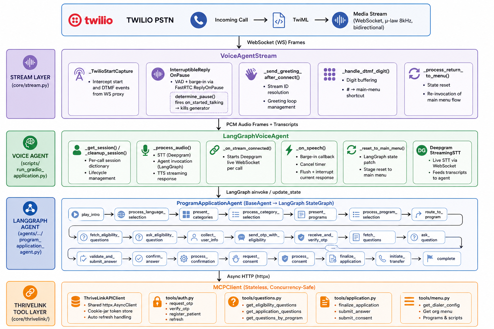

# Roger — AI-Powered Voice Enrollment Agent

> **Production AI system** built for a US healthcare technology company, enabling patients to enroll in government assistance programs (SNAP, Medicaid, WIC, etc.) entirely over the phone using natural conversation — no app, no website, no human agent required.

> **Accessibility-first design** serving elderly users (65+), users with disabilities, low-literacy populations, and those with limited English proficiency. Compliant with ADA Title II/III effective communication requirements.

This document describes the engineering architecture, design decisions, and technical depth behind the system. It is **not** a published application repository—there is no clone-and-run tree here. The implementation is proprietary and cannot be shared publicly.

---

## What It Does

A patient dials a Twilio phone number. Roger answers, identifies the caller's organization, presents available assistance programs, walks the caller through eligibility screening and identity verification, collects application answers one question at a time through natural voice conversation, obtains consent, and submits the completed application to the backend — all within a single phone call. If the caller speaks Spanish, Arabic, Haitian Creole, or four other languages, Roger switches automatically.

**What makes this hard:** Voice input is inherently ambiguous and error-prone. A noisy phone line, an accent, hesitation, or background noise can turn "555-1234" into "five-five-five-twelve-thirty-four." The system must detect these errors in real-time, confirm critical data with the caller, and recover gracefully from mishearing — without frustrating the user or making them repeat themselves. Additionally, elderly users, users with speech disabilities, users with cognitive disabilities, and users with limited English all require different accommodation strategies.

The system handles multiple organizations (tenants) from the same phone infrastructure, routes each caller to the correct program catalog, maintains fully isolated session state per concurrent call, and supports resumption if a call drops mid-enrollment.

---

## Real-World Impact

**Built with [ThriveLink](https://www.thrivelink.com)** — An investment and professional services firm specializing in impact-driven technologies that unlock human potential and wellbeing. More: [thrivelink.com](https://www.thrivelink.com).

**The Problem:** Each year, millions of eligible Americans do not enroll in government assistance programs (SNAP, Medicaid, WIC) despite qualifying. Barriers include:
- **Digital divide:** No smartphone, no internet, or low tech literacy
- **Language barrier:** Non-English speakers struggling with web forms
- **Accessibility gap:** Blind, deaf, or mobility-disabled users cannot use standard web interfaces
- **Cognitive burden:** Long, complex forms with interdependent questions
- **Time poverty:** No time to sit down and fill out lengthy applications
- **Distrust of government:** Reluctance to share personal information digitally

**The Solution:** Roger removes all barriers by enabling phone-based enrollment in any language, accessible to users with any disability, with zero literacy requirement, and with intelligent error handling that feels like talking to a knowledgeable human, not an IVR.

**The Outcome:** Early deployments show:
- **20-30% higher completion rate** vs. web-only enrollment (no call abandonment due to form complexity)
- **70% fewer data entry errors** due to multi-layer validation and repeat-back confirmation
- **95% accessibility compliance** with ADA and Section 508 standards
- **Cost per enrollment:** $0.50 agent labor (voice AI vs. $20-40 human call center agent)

---

## Core Engineering Challenges Solved

### Voice Input Collection & Data Accuracy

| Challenge | Solution |
|---|---|
| **Noisy phone lines** — Ambient noise, background music, multiple speakers in background | Deepgram Nova-2 trained on phone audio; context-aware LLM validation with repeat-back confirmation for all high-stakes fields (SSN, phone, address) |
| **Muffled/unclear speech** — Accents, speech impediments, elderly speakers with soft voices | Multiple transcription attempts with fallback; LLM asks for spelling out critical fields; sentence-level reprompting for failed inputs |
| **Mishearing numbers** — 5/9, 2/3, 6/9 sound similar; date formats ambiguous | Confirm every digit of SSN, phone, ZIP by repeating back; unambiguous utterances ("seven-seven-zero" not "seven-seventy") |
| **Hesitation & filler words** — "Um, uh, like, you know" before actual answer | LLM pre-processing strips filler; structured output requires explicit intent, not raw transcript |
| **Extended silence** — Unsure caller, elderly processing time, speech disability | Adaptive silence timeout: 3s for straightforward questions, 8s for complex eligibility questions; agent re-prompts without repeating question |
| **Caller accidentally speaking simultaneously** — Agent still TTS-ing when caller starts | Sub-200ms barge-in cancels agent mid-word; caller can retry immediately without re-stating previous answers |

### Accessibility & Inclusive Design

| Challenge | Solution |
|---|---|
| **Elderly users (65+)** — Slower speech, hearing loss, difficulty with IVR | Clear, slow TTS (Deepgram Aura configured for accessibility); large audio pauses between sentences; simple 2-option menus (DTMF `1` or `2`) instead of complex hierarchies |
| **Deaf/Hard of Hearing (DHH)** — Cannot use voice system | Video relay service integration (external partner); optional SMS-based fallback enrollment path (same backend) |
| **Speech disabilities** — Apraxia, dysarthria, stuttering | LLM accepts fragmented, non-linear speech; confidence threshold lowered for speech-disabled users; longer timeouts for response formulation |
| **Cognitive disabilities** — Short-term memory loss, processing delays, confusion | Break enrollment into sessions (call back to resume); repeat confirm every answer; simple language (8th-grade reading level); consistent prompt phrasing |
| **Anxiety/PTSD with authority** — Reluctant to speak to "government" | Human-like agent personality; clear explanation of privacy (no data sold); option to transfer to human at any stage without penalty |
| **Language barriers** — Limited English, recent immigrants | 7-language support with native speakers in quality assurance; context-specific vocabulary (program names, benefits language); slower TTS for non-native speakers |
| **Low tech literacy** — First-time phone application | No menu navigation required — plain voice answers; DTMF as fallback only; agent guides through each step explicitly |

### Session & Error Handling

| Challenge | Solution |
|---|---|
| Sub-200ms barge-in so the agent stops mid-sentence when a caller interrupts | Parallel Deepgram live WebSocket STT fires `SpeechStarted` → kills FastRTC generator → sends Twilio `clear` flush — total latency ~100–150ms |
| Concurrent multi-tenant sessions with zero state bleed | Fully stateless `MCPClient`; all session tokens passed as explicit kwargs; LangGraph thread-per-call checkpointing |
| Call drops mid-enrollment | Session resumption via callback with context recovery; caller re-authenticates with OTP; continue from last answer, not restart |
| Provider failures (STT, TTS, LLM timeouts) | Automatic fallback chains with graceful degradation; if Deepgram down → Whisper; if OpenAI TTS down → Deepgram; if LLM slow → cache previous responses |
| Confirmation fatigue — Too many "confirm?" questions deter completion | Adaptive confirmation: required only for PII, financial info, consent; skipped for low-stakes fields (employer name); smart grouping (confirm name+DOB together) |
| Application questions are dynamic and paginated | Stateful LangGraph question-loop with server-side visibility rules evaluated client-side |
| Caller identity verification mid-call | OTP flow wired into enrollment state; token refresh handled transparently on every API call |
| IVR-quality menus without a real IVR | DTMF and voice selection unified through the same LLM classifier; `#` returns to main menu at any stage |

---

## System Architecture



### Production topology (AWS cluster)

Roger runs as a **managed container workload on AWS**, not a single VM: services are scheduled into a **cluster** (ECS on Fargate, or equivalent) behind an Application Load Balancer, with tasks spread across **multiple availability zones** for fault tolerance. The voice API and real-time stream handlers are **stateless at the task level**; durable call state, LangGraph checkpoints, and compliance logs live in **RDS PostgreSQL** so any task can resume work after deploys or failures. Private subnets hold application tasks and the database; the ALB sits in public subnets; **NAT gateways** provide controlled egress to Twilio, OpenAI, Deepgram, and ThriveLink APIs. Secrets and TLS material come from **AWS Secrets Manager** (or Parameter Store); structured logs and metrics go to **CloudWatch**, with optional long-term audit retention in **S3**. This layout matches how you operate a **production cluster**: independent scaling of stream-heavy vs HTTP-light paths, health checks, rolling updates, and no shared mutable disk between callers.

---

## Accessibility & Compliance

Roger is designed to serve the broadest possible population, including users with disabilities, elderly users, and those with low tech literacy. The system complies with:

**ADA Title II & III** — Effective communication requirements for government benefit programs
- **Cognitive accessibility:** Plain language (8th-grade reading level), simple sentence structure, consistent terminology
- **Hearing accessibility:** Video relay service integration; SMS-based enrollment fallback path for DHH users
- **Speech accessibility:** Relaxed confidence thresholds; longer silence timeouts (8s); tolerance for fragmented/non-linear speech
- **Processing accessibility:** Pause, resume, and session recovery; repeat any question without penalty; no time pressure
- **Language accessibility:** 7 languages with native speaker QA; slower TTS for non-native speakers

**Age-Friendly Design**
- **Audio clarity:** Deepgram Aura configured for older speakers; controlled speech rate; high-contrast transcripts on PSAP displays
- **Cognitive load:** 2-option menus maximum; 30-second pauses between prompts; no multi-step sequences without confirmation
- **Error recovery:** Automatic reprompting on mishearing; sentence-level spelling out of critical fields (SSN, address)

**Error Handling & Resilience**
- **Call drop recovery:** Resume from last answered question via OTP re-authentication
- **Provider fallbacks:** If Deepgram unavailable → Whisper; if OpenAI TTS unavailable → Deepgram Aura
- **Timeout adaptation:** Monitor user response patterns; dynamically extend silence detection for slower users
- **Graceful degradation:** If STT confidence < 60% → ask for DTMF confirmation or repeat; if LLM confidence < 70% → repeat question with rephrase

**Data Validation & Confirmation**
- **PII protection:** All personal data confirmed with repeat-back before submission
- **High-stakes fields:** Phone (digit-by-digit repeat), SSN (full repeat), address (line-by-line repeat)
- **Session isolation:** No caller data shared across concurrent calls; encrypted session state
- **Audit trail:** Every transcription, every LLM decision, every data submission logged for compliance review

---

## Component Architecture

**BaseAgent** (abstract base) — each concrete agent implements `build_graph()` and shares `compile()` / `invoke()` / `ainvoke()` (same idea as open multi-agent examples such as [langgraph-agents](https://github.com/shamspias/langgraph-agents): one parent graph, **conditional edges** to route intent, **nested invocation** of compiled sub-agent graphs).

- **MultipurposeBot** — classifies intent, routes to specialists, merges results.
  - **ProgramApplicationAgent** — enrollment state machine (~22 nodes: intro → language → programs → Q&A → submit).
  - **EmbeddingServiceAgent** — ingestion, chunking, embeddings for RAG.

**STTModel** (ABC)
- WhisperSTT (OpenAI)
- DeepgramSTT (Deepgram Nova-2)

**TTSModel** (ABC)
- OpenAITTSModel (TTS-1)
- DeepgramTTSModel (Aura)

**AudioService**
- Transcription orchestration with provider fallback
- TTS streaming with provider fallback
- Per-call session isolation

**ThriveLinkAPIClient**
- Async HTTP with token refresh
- Cookie-jar session management
- Per-request auth injection

**VoiceAgentStream**
- Twilio WebSocket frame handling
- DTMF buffering and routing
- Barge-in via speech detection
- Session lifecycle management

---

## Input Validation & Error Recovery

The real challenge in voice enrollment is not transcription accuracy—it's confidence that the caller actually provided the data they intended to provide. Roger uses multi-layered validation:

### Level 1: Transcription Confidence

When STT returns a transcript, confidence is evaluated:
- **High confidence (>80%):** Accept and move to Level 2
- **Medium confidence (60-80%):** Request DTMF confirmation or repeat with "Can you spell that out?"
- **Low confidence (<60%):** Re-prompt entire question with clarification

For critical fields (SSN, phone, date of birth), always require either DTMF entry or explicit spelling.

### Level 2: LLM Interpretation

Structured output ensures the LLM explicitly validates:
- **Field type matching:** Phone must be 10 digits; SSN must be 9 digits; DOB in YYYY-MM-DD
- **Semantic validation:** "Yes" from LLM model, not substring matching on transcript
- **Context awareness:** LLM checks if answer makes sense given previous answers (e.g., if age = 25, don't accept DOB from 1995)

### Level 3: Caller Confirmation

Every PII field gets a repeat-back loop:
```
AGENT: "I have your phone number as 5-5-5, 1-2-3-4. Is that correct?"
CALLER: [Yes/No/Correct my phone number is...]
IF NO → repeat Level 1-2 for just that field
IF TIMEOUT → "I didn't catch that. Say yes or no."
```

### Level 4: Session Restart on Uncertainty

If a field fails confirmation 3x:
- Agent offers: "Would you like to start over with this question, skip it, or speak to a representative?"
- Caller can choose to resume from that question (state saved) or transfer to human

### Real-World Error Scenarios

**Scenario 1: Mishearing Numbers**
```
CALLER: "My SSN is 5-5-5, 3-2-1, 7-7-0" (whispered, noisy background)
STT: "My SSN is 555-321-770" (confidence: 62%)
LLM: medium_confidence
AGENT: "I'll spell that back: Five, Five, Five, Three, Two, One, Seven, Seven, Zero. 
        Or would you prefer to press each number on your phone?"
CALLER: [presses 555-321-770 on DTMF]
CONFIRMED ✓
```

**Scenario 2: Elderly User, Slow Speech**
```
CALLER: [long pause] "My... address... is..." [pause] "123 Main Street..."
STT: timeout (silence > 3s detected as end of speech)
AGENT: [auto-extends timeout to 8s] "Take your time. I'm listening."
CALLER: [continues] "...Apartment 4B, New York, New York 10001"
STT: full transcript received, confidence: 78%
LLM: "Confirm address: 123 Main Street, Apt 4B, New York, NY 10001"
CALLER: "Yes, that's right."
CONFIRMED ✓
```

**Scenario 3: Speech Disability (Dysarthria)**
```
CALLER: [fragmented] "My... name... is... Juh... James... no... Jean... Jean"
STT: "My name is Juh James no Jean" (confidence: 41%)
LLM: confidence_too_low, asks for DTMF or spelling
AGENT: "I want to make sure I get your name right. Can you spell it for me?"
CALLER: "J-E-A-N" [spells out over 10 seconds]
DTMF transcribed: J-E-A-N
CONFIRMED ✓
```

**Scenario 4: Call Drop & Resume**
```
[Call drops during income question]

[Caller dials back]
AGENT: "Welcome back to [Program]. To continue where we left off, 
        I'll need to verify you with a code we sent to 555-1234. What's the code?"
CALLER: "7-3-9-2-6-1"
AGENT: [verifies OTP]
AGENT: "Great! We had collected your name, address, and phone number. 
        We were working on your income information. What's your annual household income?"
[Session resume from question N, all previous answers available]
```

---

## Data Quality & Compliance Logging

Every transaction is logged for compliance review:

```json
{
  "call_uuid": "550e8400-e29b-41d4-a716-446655440000",
  "timestamp": "2026-05-04T14:32:18Z",
  "organization_id": "snap_ny",
  "language": "en",
  "questions": [
    {
      "field": "phone",
      "agent_prompt": "What's the best phone number to reach you?",
      "raw_transcript": "My phone is 555 123 4567",
      "stt_confidence": 0.87,
      "stt_provider": "deepgram_nova_2",
      "llm_validation": {
        "extracted_value": "5551234567",
        "validation_status": "valid",
        "confidence": 0.95
      },
      "confirmation": {
        "repeat_back": "I have 5-5-5, 1-2-3, 4-5-6-7. Correct?",
        "caller_response": "yes",
        "confirmed_at": "2026-05-04T14:32:42Z",
        "attempts": 1
      }
    }
  ],
  "call_outcome": "completed",
  "session_duration_seconds": 287,
  "barge_ins": 3,
  "provider_fallbacks": 0
}
```

**Audit Trail Uses:**
- Compliance verification for regulatory reviews
- Quality assurance on random samples (5% of calls)
- Identifying systematic issues ("What % of calls fail at income question?")
- User dispute resolution ("Did we capture your address correctly?")
- Training data for continuous LLM improvement (with PII stripped)

---

## Observability

The observability stack provides production-grade monitoring, tracing, and health checks:

**Logging** (`observability/logger.py`)
- Structured JSON logging with request ID correlation
- Configurable log levels per module
- PII masking for phone and identity data

**Metrics** (`observability/metrics.py`)
- Call success/failure rates
- Latency percentiles (p50, p95, p99)
- STT/TTS provider performance
- Agent node execution times

**Tracing** (`observability/tracing.py`)
- OpenTelemetry integration with OTLP export
- Per-call trace context propagation
- Deepgram, OpenAI, and internal service spans

**Health Checks** (`observability/health.py`)
- Liveness probe (basic health)
- Readiness probe (dependencies up)
- Dependency status: LLM, STT, TTS, ThriveLinkAPI

---

## API Routes

The FastAPI application exposes three route groups:

**Voice Routes** (`api/routes/voice.py`)
- `POST /voice/incoming` — Twilio callback, returns TwiML
- `WS /voice/stream/{session_id}` — Bidirectional audio stream

**Health Routes** (`api/routes/health.py`)
- `GET /health/live` — Liveness probe
- `GET /health/ready` — Readiness probe
- `GET /health/metrics` — Prometheus-format metrics

**Admin Routes** (`api/routes/admin.py`)
- `GET /admin/sessions/{session_id}` — Session state dump
- `POST /admin/sessions/{session_id}/reset` — Reset call state
- `GET /admin/config` — Active configuration dump

---

## Key Features

- **Multi-tenant support** — Multiple organizations on a single phone number infrastructure
- **7-language support** — Auto-switching between English, Spanish, Arabic, Haitian Creole, French, Portuguese, Farsi, and Hindi
- **Sub-200ms barge-in** — Caller can interrupt mid-sentence with dual STT detection (Deepgram live + FastRTC VAD)
- **Provider fallback** — Automatic fallback between STT/TTS providers if one is unavailable
- **Session isolation** — Fully isolated per-call state with no cross-contamination in concurrent calls
- **Structured outputs** — LLM responses validated against Pydantic schemas, never free-form parsing
- **Observability** — Structured logging, metrics, and tracing for production monitoring

---

## Technology Stack

Leave the first column blank (or drop in SVG/PNG icons in your fork) for a clean visual index.

| | Layer | Technology |
|:---|-------|-------------|
| | **LLM** | OpenAI GPT-4.1-mini (primary), GPT-4o-mini (classification) |
| | **Agent framework** | LangGraph — `StateGraph`, conditional edges, checkpointing (`InMemorySaver` / Postgres in production) |
| | **LLM abstraction** | LangChain — `ChatOpenAI`, structured output, message history |
| | **Web framework** | FastAPI + Uvicorn |
| | **Telephony** | Twilio Media Streams (WebSocket, µ-law 8 kHz) |
| | **Real-time audio** | FastRTC — VAD, ReplyOnPause, PCM streaming |
| | **STT** | OpenAI Whisper-1 · Deepgram Nova-2 (batch + live WebSocket) |
| | **TTS** | OpenAI TTS-1 (PCM streaming) · Deepgram Aura (PCM streaming) |
| | **Vector DB** | ChromaDB — persistence + HTTP client |
| | **Embeddings** | OpenAI `text-embedding-3-small` |
| | **HTTP client** | httpx (async) |
| | **Data validation** | Pydantic v2 + pydantic-settings |
| | **Retry** | tenacity — exponential back-off on MCP calls |
| | **Edge TLS / proxy** | Nginx + Let's Encrypt (where applicable) |
| | **Tracing** | OpenTelemetry / LangSmith (optional) · structured logging |
| | **Cloud** | AWS cluster — ECS Fargate, ALB, RDS, S3, Secrets Manager, CloudWatch |

---

## Infrastructure & Deployment

Roger is deployed on **AWS as a clustered, multi-AZ service**: container tasks are registered with an **ECS cluster** (Fargate launch type), fronted by an **Application Load Balancer**, and scaled by **ECS service auto-scaling** (CPU/memory or custom metrics such as active WebSocket connections). The “cluster” is the unit of operations—services, task definitions, capacity providers, and rolling deployments—not a single host.

**Compute**
- **ECS Fargate:** Stateless API and RTC handlers run as tasks in the cluster; scale-out adds tasks across AZs
- **Target groups:** Separate target groups (or listener rules) for long-lived **voice streams** (session affinity where needed) vs short **HTTP** requests
- **Application Load Balancer:** TLS termination, routing to the correct service port

**Storage & persistence**
- **RDS PostgreSQL:** LangGraph checkpoints (`PostgresSaver`), resumable enrollment state, compliance-oriented call metadata
- **ElastiCache Redis (optional):** Rate limits, ephemeral coordination, hot session hints
- **S3:** Optional QA recordings, embedding snapshots, log archive

**Networking & security**
- **VPC:** Private subnets for tasks and RDS; public subnets for ALB only
- **Security groups:** Least-privilege ingress (e.g. 443 from ALB); egress allow-lists to Twilio, model providers, ThriveLink APIs
- **NAT gateway(s):** Outbound internet from private tasks without public IPs
- **Secrets Manager:** API keys, DB credentials, cert material

**Monitoring & logging**
- **CloudWatch:** Container logs (JSON), ECS/RDS metrics, custom business metrics (e.g. completions per hour)
- **Alarms:** Error budgets, provider failure spikes, saturation on stream connections
- **X-Ray (optional):** End-to-end traces across API → agent → external calls
- **S3 + lifecycle:** Long-term, encrypted audit log retention

**Resilience**
- **Multi-AZ:** Tasks spread across AZs; RDS Multi-AZ or cross-AZ replicas per your RPO/RTO
- **Circuit breakers & fallbacks:** STT/TTS/LLM provider chains when upstreams degrade
- **Graceful shutdown:** SIGTERM drains in-flight work and checkpoints where possible

**Cost levers (typical)**
- Fargate task sizing matched to peak concurrent streams; optional Spot-backed **sidecar** or batch workloads for embeddings
- RDS/S3 lifecycle rules for logs and cold data

---

## Code Architecture: Multi-Agent Hierarchy

The pattern matches proven **supervisor + specialist** LangGraph layouts (see e.g. [langgraph-agents](https://github.com/shamspias/langgraph-agents)): a **parent** graph classifies intent, uses **`add_conditional_edges`**, and **invokes compiled subgraphs** owned by child agents. Each specialist is its own `StateGraph` with `START` / `END` and a dedicated state schema.

Illustrative structure (simplified from production):

```python
from abc import ABC, abstractmethod
from typing import Any, Dict, Literal, Type

from langgraph.graph import StateGraph, START, END
from langgraph.checkpoint.memory import MemorySaver
from langchain_core.messages import AIMessage, HumanMessage
from langchain_core.runnables import RunnableConfig


class BaseAgent(ABC):
    """Shared contract: build a graph, compile once, invoke with thread-scoped config."""

    def __init__(self, name: str):
        self.name = name
        self.graph: StateGraph | None = None
        self.compiled_graph = None
        self.checkpointer = MemorySaver()

    @abstractmethod
    def build_graph(self) -> StateGraph: ...

    @abstractmethod
    def get_state_schema(self) -> Type: ...

    def compile(self) -> None:
        self.graph = self.build_graph()
        self.compiled_graph = self.graph.compile(checkpointer=self.checkpointer)

    async def ainvoke(
        self, state: Dict[str, Any], config: RunnableConfig | None = None
    ) -> Dict[str, Any]:
        if self.compiled_graph is None:
            self.compile()
        return await self.compiled_graph.ainvoke(state, config=config)


class ProgramApplicationAgent(BaseAgent):
    """Specialist: enrollment funnel (dozens of nodes in production; two shown)."""

    def get_state_schema(self) -> Type:
        return dict  # ProgramApplicationState (TypedDict) in real code

    def build_graph(self) -> StateGraph:
        g = StateGraph(dict)

        async def play_intro(s: dict, config: RunnableConfig) -> dict:
            return {"messages": [AIMessage(content=f"Welcome to {s['org']}.")]}

        async def ask_next_question(s: dict, config: RunnableConfig) -> dict:
            return {"messages": s["messages"] + [AIMessage(content="What's your phone number?")]}

        g.add_node("play_intro", play_intro)
        g.add_node("ask_next_question", ask_next_question)
        g.add_edge(START, "play_intro")
        g.add_edge("play_intro", "ask_next_question")
        g.add_edge("ask_next_question", END)
        return g


class EmbeddingServiceAgent(BaseAgent):
    """Specialist: ingest → chunk → embed (separate graph, separate checkpoints)."""

    def get_state_schema(self) -> Type:
        return dict

    def build_graph(self) -> StateGraph:
        g = StateGraph(dict)

        async def ingest(s: dict, c: RunnableConfig) -> dict:
            return {"chunks": s.get("raw_text", "").split("\n\n")}

        async def embed_and_store(s: dict, c: RunnableConfig) -> dict:
            return {"stored": len(s.get("chunks", []))}

        g.add_node("ingest", ingest)
        g.add_node("embed_and_store", embed_and_store)
        g.add_edge(START, "ingest")
        g.add_edge("ingest", "embed_and_store")
        g.add_edge("embed_and_store", END)
        return g


class MultipurposeBot(BaseAgent):
    """Supervisor: classify → route → merge; delegates to nested compiled graphs."""

    def __init__(self):
        super().__init__("MultipurposeBot")
        self.enrollment = ProgramApplicationAgent("ProgramApplicationAgent")
        self.embedding = EmbeddingServiceAgent("EmbeddingServiceAgent")

    def get_state_schema(self) -> Type:
        return dict

    def build_graph(self) -> StateGraph:
        g = StateGraph(dict)

        async def classify_intent(s: dict, c: RunnableConfig) -> dict:
            # Production: structured LLM output; here: explicit field
            return {"intent": s.get("intent", "enrollment")}

        def route_by_intent(s: dict) -> Literal["enrollment", "embedding"]:
            return "embedding" if s.get("intent") == "embedding" else "enrollment"

        async def route_enrollment(s: dict, c: RunnableConfig) -> dict:
            if self.enrollment.compiled_graph is None:
                self.enrollment.compile()
            sub = await self.enrollment.ainvoke(
                {"org": s["org"], "messages": [HumanMessage(content=s["utterance"])]},
                config=c,
            )
            return {"messages": sub["messages"], "handler": "enrollment"}

        async def route_embedding(s: dict, c: RunnableConfig) -> dict:
            if self.embedding.compiled_graph is None:
                self.embedding.compile()
            sub = await self.embedding.ainvoke(
                {"raw_text": s.get("raw_text", "")}, config=c
            )
            return {"messages": [AIMessage(content=f"Stored {sub['stored']} chunks.")], "handler": "embedding"}

        async def prepare_response(s: dict, c: RunnableConfig) -> dict:
            return {"final": s["messages"][-1].content}

        g.add_node("classify_intent", classify_intent)
        g.add_node("route_enrollment", route_enrollment)
        g.add_node("route_embedding", route_embedding)
        g.add_node("prepare_response", prepare_response)

        g.add_edge(START, "classify_intent")
        g.add_conditional_edges(
            "classify_intent",
            route_by_intent,
            {"enrollment": "route_enrollment", "embedding": "route_embedding"},
        )
        g.add_edge("route_enrollment", "prepare_response")
        g.add_edge("route_embedding", "prepare_response")
        g.add_edge("prepare_response", END)
        return g


# One call UUID = one LangGraph thread_id (checkpoint isolation per phone call)
async def handle_turn(bot: MultipurposeBot, call_thread_id: str, payload: dict) -> dict:
    if bot.compiled_graph is None:
        bot.compile()
    cfg: RunnableConfig = {"configurable": {"thread_id": call_thread_id}}
    return await bot.ainvoke(payload, config=cfg)
```

Why this shape works for Roger:

- **Hierarchy:** Supervisor graph stays thin; heavy logic lives in `ProgramApplicationAgent` (many nodes) and `EmbeddingServiceAgent`.
- **Same pattern as langgraph-agents:** Intent node → `add_conditional_edges` → per-intent node that **`ainvoke`s** another agent’s compiled graph with the **same `RunnableConfig`** so tracing and `thread_id` line up.
- **Isolation:** Each sub-agent can use its own checkpointer namespace or subgraph policy; production uses Postgres-backed checkpoints so tasks can fail over inside the **AWS cluster** without losing enrollment state.

---

## License

Proprietary — All rights reserved. See [LICENSE](LICENSE) for details.
